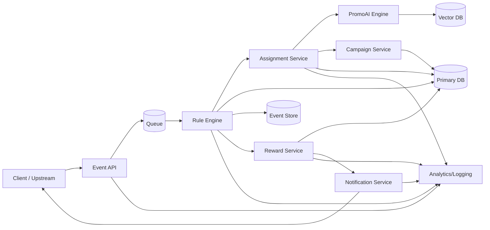

# PromoAI — Project Context

This document provides a clear, shared understanding of **PromoAI**, an AI‑assisted campaign recommendation system. It explains *why* the product exists, *what* it includes, and *how* it works so that engineering, product, and AI teams can collaborate effectively.

---

## 🎯 Purpose (Why this product exists)

Traditional campaigns apply the same rules to everyone. This hurts user experience and wastes marketing budget. **PromoAI** aims to:

- Deliver **personalized** campaigns per user.
- Use AI to achieve **maximum impact with minimal cost**.
- Make campaign assignment **measurable, iterative, and optimizable**.

Campaigns should no longer be static rule sets; they should adapt to user segment, behavior, and current context (seasonality, trends, environment).

---

## 🧱 Core System Components

### 1) Campaign Core (Campaign Engine)
- Campaign definitions (content, visuals, category, reward rate).
- Rule engine for event matching.
- Reward calculation & logging.

### 2) Event Infrastructure
- User transaction/behavior events are collected (e.g., grocery spending).
- Events flow through the rule engine for eligibility checks.

### 3) PromoAI Assignment Module (AI Decisioning)
- GPT selects the most suitable campaigns based on profile and context.
- The module **knows the full campaign set** and assigns the best options per user.

### 4) Notifications & Integrations
- Users are notified when campaigns are assigned or rewards are triggered.
- Integrates with points/cashback systems when needed.

---

## 🧭 Initial Architecture (Draft)

### 1) System Flow (End‑to‑End)
1. **Event Ingestion**: Client or upstream system sends user events to Event API.
2. **Eligibility Check**: Rule Engine evaluates event vs. campaign rules.
3. **Candidate Set**: Eligible campaigns are gathered (or pre‑filtered by segment).
4. **AI Ranking**: PromoAI ranks candidates and selects top N with reasons.
5. **Assignment Storage**: Assignment + rationale is persisted for auditability.
6. **Reward Trigger**: When a qualifying event occurs, reward calculation runs.
7. **Notification**: User is notified of assignment and/or reward.
8. **Observability**: All steps emit logs/metrics with trace IDs.

### 2) Service Boundaries (MVP‑Ready)
- **Campaign Service**: CRUD for campaigns, rule definitions, reward parameters.
- **Event API**: Ingests and validates events; queues for processing.
- **Rule Engine**: Evaluates event‑campaign match and eligibility.
- **Assignment Service**: Builds candidate set and calls PromoAI ranking.
- **PromoAI Engine**: Embedding retrieval + GPT ranking with rationale.
- **Reward Service**: Computes and issues rewards for triggered campaigns.
- **Notification Service**: Push/email dispatch + template handling.
- **Analytics/Logging**: Assignment, trigger, reward, and notification metrics.

### 3) Data Stores (Suggested)
- **Primary DB**: Campaigns, rules, assignments, rewards.
- **Event Store**: Append‑only event log for replay/debugging.
- **Vector DB**: Campaign embeddings for semantic retrieval.
- **Queue**: Event processing + notification delivery.

---

## 🧩 Service Topology (Draft)

### Logical Topology (Mermaid)



### Responsibilities & Interfaces (Short)
- **Client / Upstream**: Sends events, receives notifications.
- **Event API**: Validates and normalizes events; publishes to queue.
- **Queue**: Buffers and orders event processing.
- **Rule Engine**: Eligibility checks, trigger detection, event logging.
- **Assignment Service**: Builds candidate set, calls PromoAI, stores assignments.
- **PromoAI Engine**: Embedding retrieval + GPT ranking; returns reasons.
- **Campaign Service**: Campaign CRUD + rule and reward metadata.
- **Reward Service**: Computes reward, writes to DB, emits notifications.
- **Notification Service**: Push/email delivery + templating.
- **Analytics/Logging**: Centralized logs, metrics, and tracing.

### Notes
- Topology is **logical**; deployment can be modular monolith or microservices.
- Event processing is **async**; assignment can be sync (preview) or async (batch).

---

## 🗄️ DB & Queue Technology Decisions (MVP)

### Primary Database
- **PostgreSQL 15+** (relational + JSONB)
- Optional extension: **pgvector** for semantic retrieval

### Event Store
- **PostgreSQL append‑only** events table for MVP
- Can migrate to Kafka + object storage later if throughput demands grow

### Queue / Stream
- **Redis Streams** (consumer groups) for event processing
- Alternative: RabbitMQ (work queues) or Kafka (high‑volume streaming)

### Vector Store
- **pgvector** inside PostgreSQL for early phase
- Alternative: Qdrant/Pinecone when scale or latency requires

---

## 🔐 Authentication (Shared Pattern)

All services use the same **API key** authentication flow.

- API keys are sent via `X-API-Key` header.
- Secrets are stored **hashed** in DB (never plaintext).
- Authorization is **per service** via `api_permissions`.

See [docs/auth.md](docs/auth.md) for the full flow.

---

## 🧭 Development Approach (Step‑by‑Step Control)

We will always move **one step at a time**, with explicit check‑ins before proceeding.

**Rule:** No next step starts until the current step is reviewed and confirmed.

### Event API — Planned Steps
1. **Define request/response contracts** (JSON Schema) ✅
2. **Create minimal service skeleton** (health + POST `/events`)
3. **Validate incoming payloads** using the schema
4. **Publish to Redis Streams**
5. **Log + metrics** for ingestion success/fail
6. **Test** with sample payloads

---

## 📦 Event API Request Contract (Current)

**Request:** `POST /events`

Schema: see [contracts/event.schema.json](contracts/event.schema.json)

Note: `event_id` is server‑generated (sequential). Idempotency uses `(type, transaction_id)`.

Example:
```json
{
  "user_id": "u_001",
  "type": "purchase",
  "transaction_id": "tx_987",
  "amount": 250,
  "category": "grocery",
  "timestamp": "2026-02-09T10:30:00Z",
  "context": {"channel": "mobile"}
}
```

---

## 📐 API Contract Draft (Minimal)

### Event API
`POST /events`
```json
{
  "user_id": "u_001",
  "type": "purchase",
  "transaction_id": "tx_987",
  "amount": 250,
  "category": "grocery",
  "timestamp": "2026-02-09T10:30:00Z",
  "context": {"channel": "mobile"}
}
```

### Assignment API
`POST /assignments/preview`
```json
{
  "user_id": "u_001",
  "segment": "Gold",
  "profile": {"age": 35, "avg_spend": 7800},
  "context": ["Back to school", "Installment preference"]
}
```

Response
```json
{
  "assignments": [
    {"campaign_id": "CAMP_01", "reason": "High apparel spending."},
    {"campaign_id": "CAMP_07", "reason": "Gold segment cashback."}
  ]
}
```

### Reward API
`POST /rewards/trigger`
```json
{
  "event_id": "evt_123",
  "user_id": "u_001",
  "campaign_id": "CAMP_01"
}
```

Response
```json
{
  "reward_id": "rw_789",
  "type": "cashback",
  "value": 25
}
```

---

## 🤖 How PromoAI Is Used

### Usage Points
- At campaign assignment time: *“Which campaign is the best fit for this user?”*
- Assignments are stored with **transparent rationale**.
- Weekly trend signals can alter or re-rank campaign matches.

### Input Example

```json
{
  "age": 35,
  "segment": "Gold",
  "interests": ["electronics", "apparel"],
  "avg_spend": 7800,
  "context": ["Back to school", "Installment preference"]
}
```

### Output Example

```json
[
  {"campaign_id": "CAMP_01", "reason": "High apparel spending; installment offers are relevant."},
  {"campaign_id": "CAMP_07", "reason": "Gold segment qualifies for premium cashback."}
]
```

---

## 🧪 MVP Scope

| Module | Description |
| --- | --- |
| Campaign Definition | Admin UI to create campaigns |
| Event API | Collect transaction/behavior events |
| Rule Engine | Match events to campaigns |
| Reward Calculation | Compute points/cashback for eligible campaigns |
| PromoAI Assignment | GPT‑based matching recommendations |
| Notification Service | Inform users via push/email |

---

## ✅ Success Metrics

- Trigger rate of AI‑assigned campaigns.
- **Conversion uplift**: PromoAI vs Random assignment.
- Average reward cost per user.
- ROI per campaign.

---

## 🛣️ Roadmap (High Level)

1. System architecture: campaign core, rule engine, rewards service.
2. Event tracking API + test harness.
3. PromoAI assignment layer + campaign vector database.
4. Notification integrations.
5. Performance logging & metrics dashboard.

---

## 💡 Key Notes & Constraints

- Campaign sets are **not** directly fed into GPT prompts; they are pre‑embedded and retrieved.
- User data **does not include PII**; only behavioral/segment data.
- Phase 1 uses **pre‑enrollment**: campaigns are assigned first, events trigger later.

---

## 🔎 Clarifications for Engineering

- **Rule Engine vs AI**: The rule engine ensures eligibility; PromoAI ranks among eligible or candidate campaigns.
- **Explainability**: Every assignment stores a human‑readable reason for audits and product UX.
- **Observability**: All assignment, reward, and notification steps must be logged with trace IDs.

---

## 📌 Glossary (Short)

- **Assignment**: Selecting and attaching a campaign to a user.
- **Trigger**: A user event that makes a campaign rewardable.
- **Reward**: Points/cashback granted after a trigger.
- **Context**: Time‑based or trend‑based signals that influence selection.

---

If you want additional diagrams (data flow, service topology, sequence flows) or a Jira‑ready backlog, tell me which format you want.
